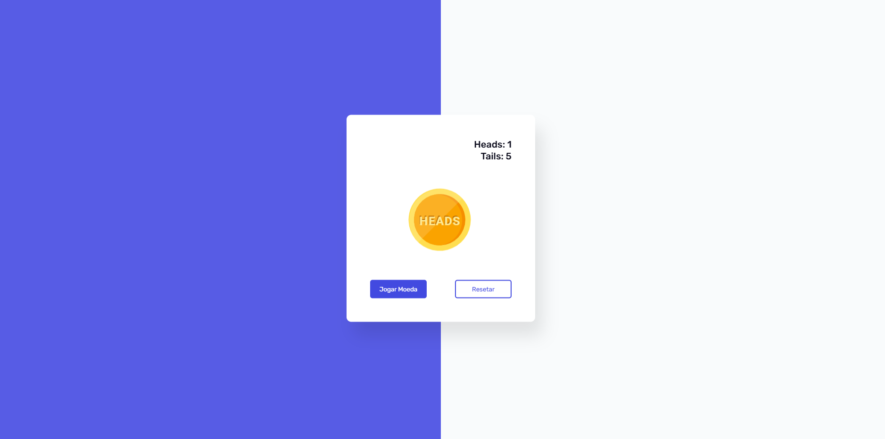

# 🪙 Mini-Game: Cara ou Coroa

Minigame interativo de **cara ou coroa** desenvolvido com **HTML, CSS e JavaScript**.  
O jogador pode lançar uma moeda virtual, visualizar a animação do resultado e acompanhar as estatísticas de vitórias.



## 🔗 Acesse o projeto:
👉 [https://caua-ricken.github.io/Mini-Game/](https://caua-ricken.github.io/Mini-Game/)

---

## 🕹️ Funcionalidades

- 🎯 Lançamento de moeda com animação.
- 📊 Contagem de resultados: cara, coroa e total.
- 🔁 Botão de reinício para zerar placar.
- Interface intuitiva e responsiva.

---

## ⚙️ Tecnologias utilizadas

- HTML5
- CSS3
- JavaScript (ES6+)

---

## 🚀 Como executar localmente

1. Clone o repositório:
   ```bash
   git clone https://github.com/seu-usuario/Mini-Game.git
